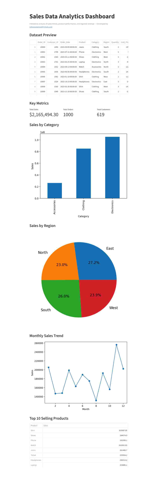

# 📊 Sales Data Analytics Dashboard

An interactive **Sales Data Analytics Dashboard** built using Python and Streamlit to analyze business sales performance, product trends, and regional revenue insights.
This project simulates a real-world sales dataset and demonstrates how data analysts transform raw data into meaningful insights through data analysis and visualization.

---

## 🚀 Project Overview

The dashboard allows users to explore and analyze sales data through interactive visualizations and summaries. It provides insights into product performance, regional distribution, and revenue patterns.

The project demonstrates key data analytics skills including:

* Data loading and preprocessing
* Exploratory data analysis
* Business insight generation
* Data visualization
* Interactive dashboard development

---

## 🛠️ Technologies Used

* **Python** – Core programming language
* **Pandas** – Data manipulation and analysis
* **Matplotlib** – Data visualization
* **Streamlit** – Interactive dashboard framework

---

## 📂 Project Output




---

## 📊 Dataset Description

The dataset simulates a typical **industry-style sales dataset** with fields commonly found in e-commerce and retail analytics systems.

### Key Fields

* **Order_ID** – Unique identifier for each order
* **Customer_ID** – Unique identifier for customers
* **Order_Date** – Date of purchase
* **Product** – Product name
* **Category** – Product category
* **Region** – Sales region
* **Quantity** – Number of items purchased
* **Unit_Price** – Price per item
* **Discount (%)** – Discount applied
* **Sales** – Final sales amount
* **Payment_Method** – Mode of payment
* **Delivery_Status** – Order fulfillment status

This structure resembles datasets used in real business analytics workflows.

---

## 📈 Dashboard Features

The dashboard provides the following analytics capabilities:

* Dataset preview
* Total sales metrics
* Sales by product category
* Region-wise sales distribution
* Top-performing products
* Interactive visualizations for business insights

---

## ▶️ How to Run the Project

### 1️⃣ Install Dependencies

```
pip install -r requirements.txt
```

### 2️⃣ Run the Streamlit Application

```
python -m streamlit run app.py
```

The dashboard will open automatically in your browser.

---

## 💼 Skills Demonstrated

This project highlights the following data analytics skills:

* Data preprocessing and analysis using Pandas
* Business-oriented data exploration
* Visualization using Python libraries
* Building interactive dashboards
* Simulating real-world analytics datasets

---

## 🙏 Acknowledgement

Parts of the code implementation and troubleshooting were developed with assistance from **GPT** to explore different approaches and accelerate learning while building the project.
The project represents a learning exercise aimed at understanding practical data analytics workflows and dashboard development.

---

## 📌 Future Improvements

Possible enhancements for the project:

* Add interactive filters for product, region, and date
* Include advanced visualizations and KPI cards
* Integrate real-world datasets
* Deploy the dashboard online for public access

---
